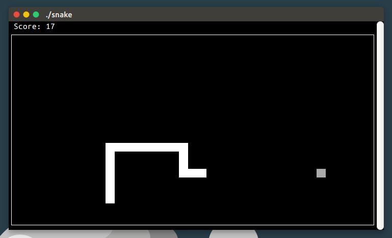

# snake

[](LICENSE)

Snake is a clone of easy name where the player maneuvers a snake which grows in length, with the snake itself being a primary obstacle. 

Snake works on your terminal.



## What's New

Snake displays every part of snake body with the same horizontal and vertical size.

It is different and more comfortable.

## Getting Started

__Dependency__

Snake only depends on `ncurses`.

|     Distro      |          Installation command          |
| :-------------: | :------------------------------------: |
| Ubuntu / Debian | `sudo apt-get install libncurses5-dev` |

__Build__

```bash
git clone https://github.com/inkzhi/snake.git
cd snake
make
./snake
```

## Control

| Key  | Action |
| :--: | :----: |
| `w`  |   UP   |
| `a`  |  LEFT  |
| `s`  |  DOWN  |
| `d`  | RIGHT  |
| `p`  | pause  |

To see some option: `./snake --help`